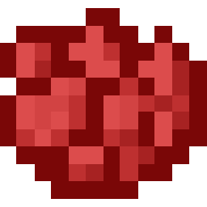
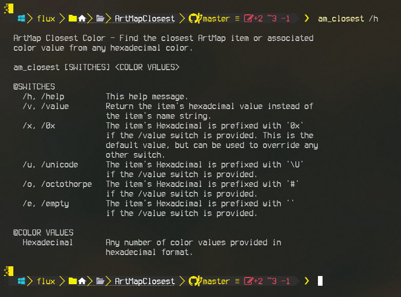
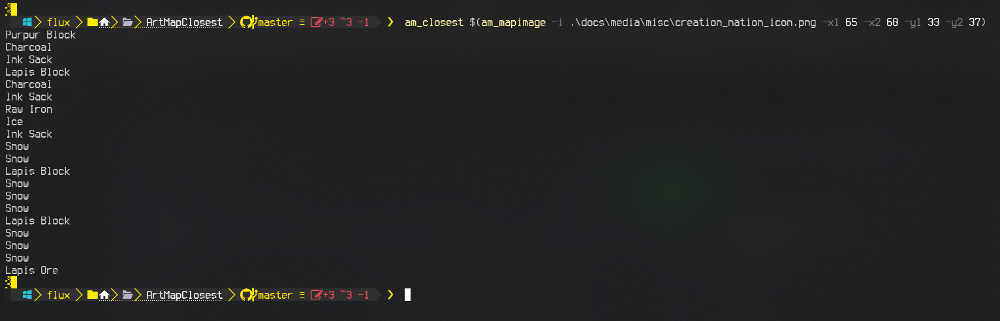

- [About](#about)
  - [Description](#description)
  - [Minecraft ArtMap Plugin](#minecraft-artmap-plugin)
  - [Motivation](#motivation)
- [Usage](#usage)
  - [Environment](#environment)
  - [How To Use](#how-to-use)
  - [Examples](#examples)
- [Project Information](#project-information)
  - [Changelog](#changelog)
    - [Coming Updates](#coming-updates)
  - [Source File Quality](#source-file-quality)
  - [File MD5 Hashes](#file-md5-hashes)
    - [Current Windows X86 MD5](#current-windows-x86-md5)
    - [Current Windows X64 MD5](#current-windows-x64-md5)
  - [Other Miscellaneous File Information](#other-miscellaneous-file-information)
- [Notes](#notes)
  - [Note 1](#note-1)
- [Media](#media)
- [Support Me If You Like](#support-me-if-you-like)
- [LICENSE](#license)

---

<!-- ***This project is*** ![Under Construction](https://img.shields.io/static/v1?logo=data:image/png;base64,iVBORw0KGgoAAAANSUhEUgAAAA4AAAAOCAYAAAAfSC3RAAACmElEQVQokUWSa0iTcRTGn//26u4b6ZQ0U8lKMqykwPpgZVBEHyLp8jEoIZJADCQ0iCiStIwuZmHRioIuroQss2VkrkIrdeFckiZqdhctTXPOve8Tr7M6X8/zO+fwPEfIwy7IwQA0GgExGYQwyhCmMLRX1z2hJCJSN+xZgqAZnPgCaAUQ0EHICjSYLlKBCDdNQb7HLmeRoy3zQFnzYk/1WTckGUIXCVD+Kw+BpAxtuBXCpkN7bdXt/JL3W3J3xuHg3iTsL/NkNFWVPoWkQOj/wxooCrRhFgiTjI4n9ZVHHQObjxVEY8UGIi1zEhVFCahwdq5qvn+hHkKC0EcBigxwvAnkW3ge7L6TMi+VztOLOOKOY8ulKL68GM2emnjeLF3AZSlz2FCZ6yaHwLGv6pkv8MyxsUoHLcsLwBuHwE0rtdy2UuLWNTpmpkkszQEfnAPDAd47tbaB7NaJR+eXujfmtGTUXgFWp5uwPd8Oi1GBJEmwWYlP34L4PSFw7chPeD+MYnkWUVmy0CeNfe5N8ANIjNWpNmHzqklYrDIGRwRm2gXsM/xofRMOf1AgcbYOAfgxMvgxCmS9+dbh5A6VarxuIMdBDoJ0g+vSreytNpAEux7qqWrK82I+kC2xYOAzyFbz5QNJPrXhdRo4XK/n3WILkxPsbKqwsr8xBB3PjukhGyJJv+qqB+QvkN0mR2Fim5pU1hobzxTYOPbcyJoTNpoAlu6wdZKvIslR0O9VXe0Clc5p2Ge4WDh36ux3ThM/1RqnNhXvilU32cjvINtAf4cKdkzlSHpBTqgNY11JfLtFA+o14NU8Wx/piggNfg2yGVR8EF9/dP37PyCIoDQLs8z9hmv71nsC4wFz9klX2tD4/AEG+gBoQ7KghD8MZ2xdnt7s7wAAAABJRU5ErkJggg==&label=Under&message=Construction&style=for-the-badge&labelColor=1D1D1D&color=ffff99)***, but coming very soon.***

--- -->

## About

This is part of a "ArtMap Suite" of tools for which the root of the project can be found here:

[https://github.com/Lateralus138/ArtMapSuite](https://github.com/Lateralus138/ArtMapSuite)

### Description

ArtMap Closest (*am_closest*) is a command line tool created specifically for the Minecraft plugin "ArtMap". This tool takes hexadecimal color values and finds the closest Minecraft item available in the plugin that would match each color.

The ArtMap plugin is limited to 60 colors plus transparency (Ender Eye) and images can not be represented pixel per pixel and therefore there is a need to find the closest value to the original color. It is possible to have up to 180 variations with the Shade and Tint tools provided by the plugin, but this tool does not provide such information at this time. Hopefully I will add this feature in version 2.

### Minecraft ArtMap Plugin

The Minecraft ArtMap plugin is maintained here:
[https://gitlab.com/BlockStack/ArtMap](https://gitlab.com/BlockStack/ArtMap)
and as such more information about the plugin can be found there.

I use this plugin when playing on the Minecraft server ***Creation Nation***:

play.cnation.net

or

buzz.cnation.net


### Motivation

Doing art with this plugin is fun, but can be a long and tedious chore and I needed tools to help me streamline the process.

---

## Usage

All files can be found in the [Releases](https://github.com/Lateralus138/ArtMapClosest/releases) tab/section. 32Bit (x86) and 64Bit (x64) excutables are provided though you should only need the 64bit option. 32Bit is provided just in case...

### Environment

This is a command line tool with arguments and as such can be run from any console/terminal, Run, shortcut, AutoHotkey, or any other method of launching a console application. I only have a Windows version for now, but I do plan to convert for Linux.

### How To Use

As with any portable program this can be placed anywhere you like on your machine, but more preferably in a directory that is in your `%PATH%` environment variable so you can run it without a full path (`am_closest` for example). I recommend using a dedicated *Bin* directory, but of course, it's your choice. If your path isn't already in your `%PATH%` environment then I suggest adding it<sup>[[1](#note-1)]</sup>, but if not then you have provide the full path (`C:\Path\To\am_closest.exe` for example) when executing the program.

This can be used by itself, but is best used with another tool: *ArtMap Map Image* (*am_mapimage*, coming soon).

### Examples

Get help:
```PowerShell
PS> am_closest /h

  ArtMap Closest Color - Find the closest ArtMap item or associated
  color value from any hexadecimal color.

  am_closest [SWITCHES] <COLOR VALUES>

  @SWITCHES
    /h, /help         This help message.
    /v, /value        Return the item's hexadcimal value instead of
                      the item's name string.
    /x, /0x           The item's Hexadcimal is prefixed with '0x'
                      if the /value switch is provided. This is the
                      default value, but can be used to override any
                      other switch.
    /u, /unicode      The item's Hexadcimal is prefixed with '\U'
                      if the /value switch is provided.
    /o, /octothorpe   The item's Hexadcimal is prefixed with '#'
                      if the /value switch is provided.
    /e, /empty        The item's Hexadcimal is prefixed with ''
                      if the /value switch is provided.

  @COLOR VALUES
    Hexadecimal       Any number of color values provided in
                      hexadecimal format.

```

Find the closest ArtMap item to the color 0xffffff (white):

```PowerShell
PS> am_closest 0xffffff
Snow
```

Find the closest ArtMap item to multiple colors:

```PowerShell
PS> am_closest 0xffffff 0xff0000
Snow
Red Dye
```

An array can be passed:

```PowerShell
PS> am_closest @(0xffffff, 0xff0000)
Snow
Red 
```
Integer values of the hexadecimals can be used as well:

```PowerShell
PS> am_closest 16777215 255
Snow
Lapis Block
```

Using am_mapimage (in PowerShell):

```PowerShell
PS> am_closest $(am_mapimage -i .\image.png -x1 33 -x2 64 -y1 33 -y2 64)
Snow
Snow
Snow
Snow
Yellow Dye
Glowstone Dust
Ink Sack
Ink Sack
Glowstone Dust
Yellow Dye
Yellow Dye
Yellow Dye
Yellow Dye
Yellow Dye
Yellow Dye
...
...
...
```

Get the hexadecimal value of the closest item (0x414141 = Flint)

```Powershell
PS> am_closest 0x454545 /v
0x414141
```

More examples to come as the other tools and scripts are released.

---

## Project Information

&#x54;&#x68;&#x69;&#x73;&#x20;&#x70;&#x72;&#x6f;&#x6a;&#x65;&#x63;&#x74;&#x20;&#x69;&#x73;&#x20;&#x77;&#x72;&#x69;&#x74;&#x74;&#x65;&#x6e;&#x20;&#x69;&#x6e;&#x20;`C++`.

[![C++](https://img.shields.io/endpoint?url=https://raw.githubusercontent.com/Lateralus138/ArtMapClosest/master/docs/json/cpp.json&logo=data%3Aimage%2Fpng%3Bbase64%2CiVBORw0KGgoAAAANSUhEUgAAABAAAAAQCAMAAAAoLQ9TAAAABGdBTUEAALGPC%2FxhBQAAACBjSFJNAAB6JgAAgIQAAPoAAACA6AAAdTAAAOpgAAA6mAAAF3CculE8AAABcVBMVEUAAAAAgM0Af8wolNQAa7YAbbkAQIcAQIYAVJ0AgM0AgM0AgM0AgM0AgM0AgM0AgM0AgM0AgM0AgM0Af8wAfswAfswAf8wAgM0AgM0AgM0Af80AgM0AgM0AgM0AgM0Af8wAgM0Af80djtIIg84Af8wAfsxYrN4Fg84Gg85RqNwej9MLhM8LhM8AfcsAgM0Hg88AfsshkNNTqd1%2Fv%2BUXi9AHdsAAYKoAY64ih8kAf81YkcEFV54GV55Sj8EnlNULhc8AecYdebwKcrsAe8gAb7oAXacAXqgAcLwAImUAUpoAVJ0AUpwAUZoAIWMAVJ0AVJ0AUpwAUZwAVJ0AVJ0AVJ0AVJ0AgM0cjtJqteGczetqtOEAf807ndjL5fT9%2Fv7%2F%2F%2F%2FM5fQ9ntnu9vu12vCi0Oz%2F%2F%2F6Hw%2Bebzeufz%2Bx%2Bv%2BW12e%2Bgz%2BxqteLu9fmRx%2BjL3Ovu8%2Fi1zeKrzeUAUpw7e7M8fLQAU50cZ6hqm8WcvNgAVJ3xWY3ZAAAAVnRSTlMAAAAAAAAAAAAREApTvrxRCQQ9rfX0qwErleyUKjncOFv%2B%2Fv5b%2Ff7%2B%2Fv7%2B%2Fv1b%2Ff7%2B%2Fv7%2BW%2F7%2B%2Fv79%2Fv7%2B%2Fv7%2B%2Fv7%2B%2Fjfa2jcBKJHqKAEEO6r0CVC8EFaOox4AAAABYktHRF9z0VEtAAAACXBIWXMAAA7DAAAOwwHHb6hkAAAAB3RJTUUH5QYKDQws%2FBWF6QAAAONJREFUGNNjYAABRkZOLkZGBhhgZOTm4eXjF4AJMQoKCYuEhYmKCQmCRBjFJSSlwiMiI6PCpaRlxBkZGGXlomNi4%2BLj4xISo%2BXkgQIKikqx8UnJyUnxKcqKKiAB1ajUJDV1Dc00LW0dXSaggF56fLK%2BgYFhhlGmsQkzRCDL1MzcIhsmYJkTn2tlbWObZ2cP0sKk4OCYH19QWFgQX%2BTkrMLEwOLiWlySD7I2v7TMzZ2Vgc3D08u7vKKysqLc28vHlx3oVg4%2F%2F4DAqqrAAH8%2FDohnODiCgkNCgoM4OOD%2B5eAIDYVyAZ9mMF8DmkLwAAAAJXRFWHRkYXRlOmNyZWF0ZQAyMDIxLTA2LTEwVDE4OjEyOjQ0LTA1OjAwkjvGQgAAACV0RVh0ZGF0ZTptb2RpZnkAMjAyMS0wNi0xMFQxODoxMjo0NC0wNTowMONmfv4AAAAASUVORK5CYII%3D)](http://www.cplusplus.org/)

### Changelog

  - 1.0.0.0 - Initial release.

#### Coming Updates
  - 2.0.0.0 Possibly add features to find the closest item + shade & tint. This ***might*** give a better outcome, but not necessarily. It would just depend on the image.

### Source File Quality

&#x54;&#x68;&#x69;&#x73;&#x20;&#x69;&#x73;&#x20;&#x67;&#x72;&#x61;&#x64;&#x65;&#x64;&#x20;&#x62;&#x79;&#x20;&#x43;&#x6f;&#x64;&#x65;&#x46;&#x61;&#x63;&#x74;&#x6f;&#x72;&#x20;&#x61;&#x6e;&#x64;&#x20;&#x69;&#x73;&#x20;&#x73;&#x75;&#x62;&#x6a;&#x65;&#x63;&#x74;&#x69;&#x76;&#x65;&#x2c;&#x20;&#x62;&#x75;&#x74;&#x20;&#x68;&#x65;&#x6c;&#x70;&#x73;&#x20;&#x6d;&#x65;&#x20;&#x74;&#x6f;&#x20;&#x72;&#x65;&#x66;&#x61;&#x63;&#x74;&#x6f;&#x72;&#x20;&#x6d;&#x79;&#x20;&#x77;&#x6f;&#x72;&#x6b;&#x2e;

|                                                Name                                                 |                                                                        Status                                                                        |
| :-------------------------------------------------------------------------------------------------: | :--------------------------------------------------------------------------------------------------------------------------------------------------: |
| [codefactor.io](https://www.codefactor.io/repository/github/lateralus138/ArtMapClosest) |  |

### File MD5 Hashes

&#x41;&#x6c;&#x6c;&#x20;&#x68;&#x61;&#x73;&#x68;&#x65;&#x73;&#x20;&#x61;&#x72;&#x65;&#x20;&#x72;&#x65;&#x74;&#x72;&#x69;&#x65;&#x76;&#x65;&#x64;&#x20;&#x61;&#x74;&#x20;&#x63;&#x6f;&#x6d;&#x70;&#x69;&#x6c;&#x65;&#x2f;&#x62;&#x75;&#x69;&#x6c;&#x64;&#x20;&#x74;&#x69;&#x6d;&#x65;&#x2e;

#### Current Windows X86 MD5


#### Current Windows X64 MD5


### Other Miscellaneous File Information

|           Description            |                                                                                Status                                                                                |
| :------------------------------: | :------------------------------------------------------------------------------------------------------------------------------------------------------------------: |
|       Project Release Date       |          |
| Total downloads for this project |       |
|     Complete repository size     |                  |
|      Commits in last month       |  |
|       Commits in last year       |  |


---

## Notes

### Note 1

[Adding a path to the Windows %PATH% environment variable search @ DuckDuckGo](https://duckduckgo.com/?q=Adding+a+path+to+the+Windows+%25PATH%25+environment+variable&ia=web)

---

## Media

Logo



Help



Section of an image



---

## Support Me If You Like

&#x49;&#x66;&#x20;&#x79;&#x6f;&#x75;&#x20;&#x6c;&#x69;&#x6b;&#x65;&#x20;&#x61;&#x6e;&#x79;&#x20;&#x6f;&#x66;&#x20;&#x74;&#x68;&#x65;&#x20;&#x70;&#x72;&#x6f;&#x6a;&#x65;&#x63;&#x74;&#x73;&#x20;&#x62;&#x65;&#x6c;&#x6f;&#x77;&#x20;&#x61;&#x6e;&#x64;&#x20;&#x63;&#x61;&#x72;&#x65;&#x20;&#x74;&#x6f;&#x20;&#x64;&#x6f;&#x6e;&#x61;&#x74;&#x65;&#x20;&#x74;&#x6f;&#x20;&#x6d;&#x79;&#x20;***PayPal***&#x3a;

[](https://paypal.me/ianapride?locale.x=en_US)

&#x4f;&#x72;&#x20;***Buy Me A Coffee***&#x20;&#x69;&#x66;&#x20;&#x79;&#x6f;&#x75;&#x72;&#x20;&#x70;&#x72;&#x65;&#x66;&#x65;&#x72;&#x3a;

[](https://www.buymeacoffee.com/ianalanpride)

---

## [LICENSE](./LICENSE)


<details>
  <summary>&#x4C;&#x69;&#x63;&#x65;&#x6E;&#x73;&#x65;&#x20;&#x45;&#x78;&#x63;&#x65;&#x72;&#x70;&#x74;</summary>
  <br>
  <blockquote>
  &#x20;&#x54;&#x68;&#x69;&#x73;&#x20;&#x70;&#x72;&#x6F;&#x67;&#x72;&#x61;&#x6D;&#x20;&#x69;&#x73;&#x20;&#x66;&#x72;&#x65;&#x65;&#x20;&#x73;&#x6F;&#x66;&#x74;&#x77;&#x61;&#x72;&#x65;&colon;&#x20;&#x79;&#x6F;&#x75;&#x20;&#x63;&#x61;&#x6E;&#x20;&#x72;&#x65;&#x64;&#x69;&#x73;&#x74;&#x72;&#x69;&#x62;&#x75;&#x74;&#x65;&#x20;&#x69;&#x74;&#x20;&#x61;&#x6E;&#x64;&sol;&#x6F;&#x72;&#x20;&#x6D;&#x6F;&#x64;&#x69;&#x66;&#x79;&#x20;&#x69;&#x74;&#x20;&#x75;&#x6E;&#x64;&#x65;&#x72;&#x20;&#x74;&#x68;&#x65;&#x20;&#x74;&#x65;&#x72;&#x6D;&#x73;&#x20;&#x6F;&#x66;&#x20;&#x74;&#x68;&#x65;&#x20;&#x47;&#x4E;&#x55;&#x20;&#x47;&#x65;&#x6E;&#x65;&#x72;&#x61;&#x6C;&#x20;&#x50;&#x75;&#x62;&#x6C;&#x69;&#x63;&#x20;&#x4C;&#x69;&#x63;&#x65;&#x6E;&#x73;&#x65;&#x20;&#x61;&#x73;&#x20;&#x70;&#x75;&#x62;&#x6C;&#x69;&#x73;&#x68;&#x65;&#x64;&#x20;&#x62;&#x79;&#x20;&#x74;&#x68;&#x65;&#x20;&#x46;&#x72;&#x65;&#x65;&#x20;&#x53;&#x6F;&#x66;&#x74;&#x77;&#x61;&#x72;&#x65;&#x20;&#x46;&#x6F;&#x75;&#x6E;&#x64;&#x61;&#x74;&#x69;&#x6F;&#x6E;&comma;&#x20;&#x65;&#x69;&#x74;&#x68;&#x65;&#x72;&#x20;&#x76;&#x65;&#x72;&#x73;&#x69;&#x6F;&#x6E;&#x20;&#x33;&#x20;&#x6F;&#x66;&#x20;&#x74;&#x68;&#x65;&#x20;&#x4C;&#x69;&#x63;&#x65;&#x6E;&#x73;&#x65;&comma;&#x20;&#x6F;&#x72;&#x20;&lpar;&#x61;&#x74;&#x20;&#x79;&#x6F;&#x75;&#x72;&#x20;&#x6F;&#x70;&#x74;&#x69;&#x6F;&#x6E;&rpar;&#x20;&#x61;&#x6E;&#x79;&#x20;&#x6C;&#x61;&#x74;&#x65;&#x72;&#x20;&#x76;&#x65;&#x72;&#x73;&#x69;&#x6F;&#x6E;&period;
  </blockquote>
  <br>
  <blockquote>
  &#x54;&#x68;&#x69;&#x73;&#x20;&#x70;&#x72;&#x6F;&#x67;&#x72;&#x61;&#x6D;&#x20;&#x69;&#x73;&#x20;&#x64;&#x69;&#x73;&#x74;&#x72;&#x69;&#x62;&#x75;&#x74;&#x65;&#x64;&#x20;&#x69;&#x6E;&#x20;&#x74;&#x68;&#x65;&#x20;&#x68;&#x6F;&#x70;&#x65;&#x20;&#x74;&#x68;&#x61;&#x74;&#x20;&#x69;&#x74;&#x20;&#x77;&#x69;&#x6C;&#x6C;&#x20;&#x62;&#x65;&#x20;&#x75;&#x73;&#x65;&#x66;&#x75;&#x6C;&comma;&#x20;&#x62;&#x75;&#x74;&#x20;&#x57;&#x49;&#x54;&#x48;&#x4F;&#x55;&#x54;&#x20;&#x41;&#x4E;&#x59;&#x20;&#x57;&#x41;&#x52;&#x52;&#x41;&#x4E;&#x54;&#x59;&semi;&#x20;&#x77;&#x69;&#x74;&#x68;&#x6F;&#x75;&#x74;&#x20;&#x65;&#x76;&#x65;&#x6E;&#x20;&#x74;&#x68;&#x65;&#x20;&#x69;&#x6D;&#x70;&#x6C;&#x69;&#x65;&#x64;&#x20;&#x77;&#x61;&#x72;&#x72;&#x61;&#x6E;&#x74;&#x79;&#x20;&#x6F;&#x66;&#x20;&#x4D;&#x45;&#x52;&#x43;&#x48;&#x41;&#x4E;&#x54;&#x41;&#x42;&#x49;&#x4C;&#x49;&#x54;&#x59;&#x20;&#x6F;&#x72;&#x20;&#x46;&#x49;&#x54;&#x4E;&#x45;&#x53;&#x53;&#x20;&#x46;&#x4F;&#x52;&#x20;&#x41;&#x20;&#x50;&#x41;&#x52;&#x54;&#x49;&#x43;&#x55;&#x4C;&#x41;&#x52;&#x20;&#x50;&#x55;&#x52;&#x50;&#x4F;&#x53;&#x45;&period;&#x20;&#x20;&#x53;&#x65;&#x65;&#x20;&#x74;&#x68;&#x65;&#x20;&#x47;&#x4E;&#x55;&#x20;&#x47;&#x65;&#x6E;&#x65;&#x72;&#x61;&#x6C;&#x20;&#x50;&#x75;&#x62;&#x6C;&#x69;&#x63;&#x20;&#x4C;&#x69;&#x63;&#x65;&#x6E;&#x73;&#x65;&#x20;&#x66;&#x6F;&#x72;&#x20;&#x6D;&#x6F;&#x72;&#x65;&#x20;&#x64;&#x65;&#x74;&#x61;&#x69;&#x6C;&#x73;&period;
  </blockquote>
</details>